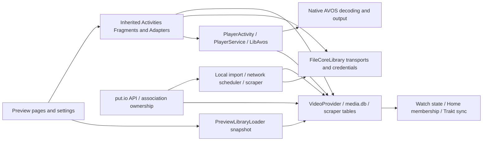

# App-wide functional inventory

Baseline `2a9380abf97a89ec35d91f7c7a9b03327364634f` on `codex/post-4.1.7-shield-fixes`. Source-established, static audit only; all dispositions future-only. [Settings](SETTINGS_FUNCTIONAL_INVENTORY.md) and [Network & Files](NETWORK_FILES_FUNCTIONAL_INVENTORY.md) contain priority row-level inventories. This file covers remaining workflows and their shared foundations.

## Workflow inventory

Related menus are grouped only when their handler/data domain is shared; every named child is included explicitly. Manifest entrypoints, Java callback/control occurrences, preference declarations and source files are enumerated separately in [source register](FUNCTIONAL_AUDIT_SOURCE_REGISTER.md). These indexes are discovery/completeness aids, not claims of runtime execution. Tests below name available coverage; execution status is in [test register](FUNCTIONAL_AUDIT_TEST_REGISTER.md).

|Subsystem|UI trigger / control|Implementation chain|Persisted data / dependencies|Effects, safety and limits|Feature state|Source evidence|Test evidence (presence, not necessarily executed)|
|---|---|---|---|---|---|---|---|
|Startup|Launcher / external data intent|EntryActivity → UiChoiceDialog → MainActivityLeanback or browser.MainActivity; forwards data/extras and clear-top/single-top|uimode, uimode_leanback, always_leanback_on_tv_key, try_new_ui|Startup writes synchronized UI values; Preview gating does not imply legacy activity unreachable|Implemented + shared legacy|[EntryActivity.java:61](https://github.com/heretoecode/Supernova/blob/2a9380abf97a89ec35d91f7c7a9b03327364634f/src/main/java/com/archos/mediacenter/video/EntryActivity.java#L61)|PreviewStartupTest|
|Startup|Application attach / interrupted restore|CustomApplication.attachBaseContext → RestoreJournal.recover; fail closed if recovery impossible → SftpHostTrust.initialise → conditional SentryAndroid|Restore journal/recovery copies, SFTP identity pins|May restore prior DB/preferences before UI; ENABLE_BUG_REPORT controls inherited Sentry, separate from opt-in local diagnostic log|Implemented; build/platform conditional|[CustomApplication.java:470](https://github.com/heretoecode/Supernova/blob/2a9380abf97a89ec35d91f7c7a9b03327364634f/src/main/java/com/archos/mediacenter/video/CustomApplication.java#L470)|RestoreJournalTest, DiagnosticsTest|
|Startup|Permissions / initial local import|MainActivityLeanback → PermissionChecker/manage-external-storage → VideoStore import and scraper observer; phone browser equivalent|Android permissions, MediaStore, DB import state|Storage denied means unavailable files; runtime prompts/API scopes differ; do not infer no media from inaccessible store|Implemented|[MainActivityLeanback.java:199](https://github.com/heretoecode/Supernova/blob/2a9380abf97a89ec35d91f7c7a9b03327364634f/src/main/java/com/archos/mediacenter/video/leanback/MainActivityLeanback.java#L199)|PreviewStartupTest|
|Navigation|Home, Movies, TV Shows, Network & Files, Search, Settings|TopNavigation visual order [0,1,2,3,5,4]; callback maps first 4 to PreviewPages.setTab; Search/Settings launch activity|Active tab; preview_tab intent; per-page focus/scroll|Focus differs from click; new route may clear-top/finish; tab state restoration semantic keys; no library writes|Implemented Preview|[TopNavigation.java:20](https://github.com/heretoecode/Supernova/blob/2a9380abf97a89ec35d91f7c7a9b03327364634f/src/main/java/com/archos/mediacenter/video/leanback/TopNavigation.java#L20)|Preview417NavigationTest, PreviewPagesTest|
|Navigation|Back / long Back / LEFT / RIGHT / UP / DOWN|MainActivityLeanback long Back opens Settings; normal Back first focuses top navigation; PreviewPages child/back routing; dialogs restore opener|View state, page/item/scroll identities, diagnostics tokens|Removed item bounded fallback; device/process death focus remains runtime limit|Implemented shared|[MainActivityLeanback.java:147](https://github.com/heretoecode/Supernova/blob/2a9380abf97a89ec35d91f7c7a9b03327364634f/src/main/java/com/archos/mediacenter/video/leanback/MainActivityLeanback.java#L147)|PreviewLibraryReturnTest, PreviewDialogStackTest|
|Startup/Home|Cold start / cached library / readiness shade|MainFragment creates hidden native Browse fragment + PreviewPages; memory/disk snapshot; startup shade waits hasComposedContent and pre-draw then fades|preview-library-v41 cache, current DB snapshot|Disk cache is presentation fallback; cache read failure does not delete library; privacy mode suppresses cache|Implemented|[MainFragment.java:373](https://github.com/heretoecode/Supernova/blob/2a9380abf97a89ec35d91f7c7a9b03327364634f/src/main/java/com/archos/mediacenter/video/leanback/MainFragment.java#L373)|PreviewStartupTest, PreviewHomeHotfixTest|
|Home|Featured ready/promotion/rotation|PreviewPages.featured + PreviewFeaturedCard + PreviewDiscovery local/chart pools; artwork/logo readiness and stable promotion/indicators|preview_featured_recent/trending/popular, chart/art caches, selected candidate|Local title matching; chart network unavailable has local fallback; no invented streaming-library titles in local Featured|Implemented; latest Home hotfix physical QA pending|[PreviewPages.java:244](https://github.com/heretoecode/Supernova/blob/2a9380abf97a89ec35d91f7c7a9b03327364634f/src/main/java/com/archos/mediacenter/video/leanback/PreviewPages.java#L244)|PreviewFeaturedIndicatorsTest, PreviewHomeHotfixTest, PreviewHomeVisualTest|
|Home|Featured More Info (sole action)|PreviewFeaturedCard sole More Info callback opens Details; constructor still accepts play callback but does not expose it|Navigation entry/focus; no direct Featured playback or membership mutation|Featured action only navigates to Details; Play/Resume and Add to Row belong to other reachable surfaces|Implemented|[PreviewFeaturedCard.java:15](https://github.com/heretoecode/Supernova/blob/2a9380abf97a89ec35d91f7c7a9b03327364634f/src/main/java/com/archos/mediacenter/video/leanback/PreviewFeaturedCard.java#L15)|PreviewHomeMaximumTest, Preview41RowsTest|
|Home|Seven default system rows|PreviewHomeRows.SYSTEM: Continue Watching, Watch Next, Recently Added, Trending on Trakt — In Your Library, Popular on Trakt — In Your Library, Recently Watched, Because You Watched; PreviewPages selects snapshots/rows|preview_home_rows41 JSON visibility/order/members; playback/watch DB|Empty rows generally omitted; chart error/empty notices explicit; local readiness can show loading/fallback without fabricating titles|Implemented|[PreviewHomeRows.java:13](https://github.com/heretoecode/Supernova/blob/2a9380abf97a89ec35d91f7c7a9b03327364634f/src/main/java/com/archos/mediacenter/video/leanback/PreviewHomeRows.java#L13)|PreviewHomeHotfixTest, Preview41RowsTest|
|Home|Continue Watching click / long click|PreviewLibraryLoader.applyJourneys → PreviewSeriesJourney next/resume; click play; More Info / Add to Row / Dismiss from Continue Watching|Video checkpoint/watch state; preview_cw_dismiss:<key> timestamp|Dismiss hides until new activity; no watch reset; Continue Watching supersedes Watch Next membership|Implemented|[PreviewPages.java:638](https://github.com/heretoecode/Supernova/blob/2a9380abf97a89ec35d91f7c7a9b03327364634f/src/main/java/com/archos/mediacenter/video/leanback/PreviewPages.java#L638)|PreviewLibraryReturnTest, Preview41ProgressTest|
|Home|Customise Home, Move, Hide; Shown / Hidden|PreviewPages inline move/hide and PreviewHomeRows editor reorder UP/DOWN; visible row targeting preserves hidden/empty row members|preview_home_rows41|Presentation only; no library/media deletion; delete custom row explicit confirmation keeps titles|Implemented|[PreviewHomeRows.java:84](https://github.com/heretoecode/Supernova/blob/2a9380abf97a89ec35d91f7c7a9b03327364634f/src/main/java/com/archos/mediacenter/video/leanback/PreviewHomeRows.java#L84)|Preview41RowsTest, PreviewHomeMaximumTest|
|Home|Custom row More: Rename / Genre rule & contents / Delete row|Name input (40 chars), dynamic genre rule On/Off, Genres, Movies, TV Shows, Sort, Maximum items, Done; source type cannot both be off|JSON dynamic/movies/tv/genres/sort/maximum/member fields|Rule-based smart custom Home rows **are implemented**; separate from full collection product and inherited movie franchises|Implemented|[PreviewHomeRows.java:85](https://github.com/heretoecode/Supernova/blob/2a9380abf97a89ec35d91f7c7a9b03327364634f/src/main/java/com/archos/mediacenter/video/leanback/PreviewHomeRows.java#L85)|PreviewHomeMaximumTest, Preview41RowsTest|
|Home|Row sort / Maximum items / explicit membership|Date Added / Title / Year; No Limit,10,20,30,40,50,75,100,Select… (0..2147483647); Add to Row selects explicit Watch Next/manual custom rows/Create New Row…|Home JSON membership and rule max|Dynamic row cannot receive manual Add-to-Row membership; clear Watch Next loses explicit members after Cancel/Clear; no history deletion|Implemented|[PreviewHomeRows.java:39](https://github.com/heretoecode/Supernova/blob/2a9380abf97a89ec35d91f7c7a9b03327364634f/src/main/java/com/archos/mediacenter/video/leanback/PreviewHomeRows.java#L39)|PreviewHomeMaximumTest|
|Movies/TV|Grid view / List view|PreviewPages per-tab listMode → card presenter or PreviewLibraryColumns rows; logical variants collapse physical duplicates|preview view prefs separately for Movies/TV when remember=true|Visual state persisted; source identities remain physical for Search, version choice and scanner|Implemented|[PreviewPages.java:577](https://github.com/heretoecode/Supernova/blob/2a9380abf97a89ec35d91f7c7a9b03327364634f/src/main/java/com/archos/mediacenter/video/leanback/PreviewPages.java#L577)|PreviewPagesTest, no dedicated test located|
|Movies/TV|Filters → Genre / Year / Streaming Service / Clear Filters|Genres/year multiselect with Clear Selection; provider IDs limited to selected country catalogue and known availability|Per-tab genre/year/provider filter keys; streaming cache|Unknown provider availability can exclude otherwise existing local titles; no library deletion; runtime refresh/network dependent|Implemented|[PreviewPages.java:522](https://github.com/heretoecode/Supernova/blob/2a9380abf97a89ec35d91f7c7a9b03327364634f/src/main/java/com/archos/mediacenter/video/leanback/PreviewPages.java#L522)|PreviewProviderFilterTest, no dedicated test located|
|Movies/TV|Sort / Order|Date Added,Title,Air Date( TV ) or Release Date( Movies ),Trakt Trending,Trakt Popular plus metadata columns; unavailable charts no-op; Ascending/Descending|Per-tab sorts/direction, quietOrder snapshot, columns sort|Sort title honors sort_ignore_articles; unknown technical values sort last in both directions; late enrichment stabilizes order during active focus|Implemented|[PreviewPages.java:497](https://github.com/heretoecode/Supernova/blob/2a9380abf97a89ec35d91f7c7a9b03327364634f/src/main/java/com/archos/mediacenter/video/leanback/PreviewPages.java#L497)|PreviewPagesTest, PreviewProviderRefreshTest|
|Movies/TV|Columns; header sort; reset/default/done and drag reorder|16 TV columns: Title,Year,Seasons,Episodes,Runtime,Resolution,HDR,Audio,File size,Avg. ep. size,Date added,Modified,Codec,Bitrate,Container,Path; Movies excludes Seasons/Episodes/Average (13)|preview_columns_movies_/tv_ order, shown, sort, ascending|Title always shown; aggregate lower-bound sizes/unknown average honest; no file enumeration on each row bind|Implemented|[PreviewLibraryColumns.java:18](https://github.com/heretoecode/Supernova/blob/2a9380abf97a89ec35d91f7c7a9b03327364634f/src/main/java/com/archos/mediacenter/video/leanback/PreviewLibraryColumns.java#L18)|PreviewPagesTest, PreviewMediaInfoTest|
|Movies/TV|Matched / Unmatched toolbar conditional|hasUnmatched checks classification hints; source switch to unmatched files → existing Details/Find a Match|preview_source_kind:<URI>; physical DB unmatched state|Unknown classification eligible for both appropriate views; explicit hint is not TMDb identity. Future Library Health migration unimplemented|Implemented current; approved future move|[PreviewPages.java:518](https://github.com/heretoecode/Supernova/blob/2a9380abf97a89ec35d91f7c7a9b03327364634f/src/main/java/com/archos/mediacenter/video/leanback/PreviewPages.java#L518)|PreviewMediaClassificationTest, PreviewMatchStateTest|
|Library snapshot|Background indexed DB query / reject bad record / fallback|PreviewLibraryLoader extends AllVideosLoader; VideoCursorMapper, show query, PreviewMetadata hydrate; build movies/shows/recent/watch/episode collections; variants/journeys|VideoProvider video/scraper joins; snapshot cache|32 rejected-record bound, records not changed on read failure; preserve memory snapshot, warning; watched filter applied later, user-hidden filter at load|Implemented shared|[PreviewLibraryLoader.java:152](https://github.com/heretoecode/Supernova/blob/2a9380abf97a89ec35d91f7c7a9b03327364634f/src/main/java/com/archos/mediacenter/video/leanback/PreviewLibraryLoader.java#L152)|no dedicated test located, PreviewPagesTest, PreviewMatchMembershipTest|
|Search|Search tab / query / on-screen keyboard / results|VideoSearchActivity Preview gate → PreviewSearch debounced worker local DB loaders; titles and individual episode/file variants; inherited voice/system routes separate|Query transient; selected result/focus; artwork cache|Read-only local results, generation/cancellation guards; no global remote catalogue universe invented; empty/error statuses|Implemented Preview + classic/system search|[PreviewSearch.java:25](https://github.com/heretoecode/Supernova/blob/2a9380abf97a89ec35d91f7c7a9b03327364634f/src/main/java/com/archos/mediacenter/video/leanback/search/PreviewSearch.java#L25)|PreviewSearchPresentationTest, PreviewMatchSearchTest|
|Keyboard|Character / space / delete / clear / submit / language keyboard modes|PreviewKeyboard over EditText; keyboard focus retained through popup/Back; PreviewTextInput validation for names/search|Text/current key transient; native input preference where relevant|No automatic external text transmission except explicitly chosen provider search/auth workflow|Implemented shared|[PreviewKeyboard.java:12](https://github.com/heretoecode/Supernova/blob/2a9380abf97a89ec35d91f7c7a9b03327364634f/src/main/java/com/archos/mediacenter/video/leanback/PreviewKeyboard.java#L12)|Preview417NavigationTest, PreviewSearchPresentationTest|
|Matching|Find a Match / title,TMDB ID,IMDb ID|ManualScrappingSearchFragment PreviewMatchSearch → native Scraper search ranked by PreviewSearchText → result review|No accepted identity until Use This Match; query transient|350ms debounce; Searching/No matches/Unavailable; explicit review before metadata writes|Implemented|[ManualScrappingSearchFragment.java:151](https://github.com/heretoecode/Supernova/blob/2a9380abf97a89ec35d91f7c7a9b03327364634f/src/main/java/com/archos/mediacenter/video/leanback/scrapping/ManualScrappingSearchFragment.java#L151)|PreviewMatchFragmentTest, PreviewMatchSearchTest, PreviewMatchReviewTest|
|Matching|Use This Match / Cancel / episode/series correction|ManualVideoScrappingSearchFragment.savePreviewMatch fixes accepted tags, downloads art and persistAcceptedMatch(videoId); show correction rewrites episode identities then reconciles Home memberships|Scraper movie/show/episode tags and online IDs; same physical file/bookmark history; technical/provider cache invalidation|Wrong choice changes metadata/classification; save failure retains chooser, no fake success; series-wide worker impacts many episodes|Implemented; side-effect high|[ManualVideoScrappingSearchFragment.java:258](https://github.com/heretoecode/Supernova/blob/2a9380abf97a89ec35d91f7c7a9b03327364634f/src/main/java/com/archos/mediacenter/video/leanback/scrapping/ManualVideoScrappingSearchFragment.java#L258)|PreviewMatchMembershipTest, PreviewCorrectiveAuthorityTest|
|Matching|Change Series Match / S1E1/episode search|Episode fragment reads accepted parent show; series correction activity → resumed child search; worker saves new show and episode links|Show IDs; Home s<id> memberships/dismiss key reconciliation|Keep; preserves physical file intent; fallback parent unreadable notice; external catalogue correctness unresolved|Implemented|[ManualShowScrappingSearchFragment.java:423](https://github.com/heretoecode/Supernova/blob/2a9380abf97a89ec35d91f7c7a9b03327364634f/src/main/java/com/archos/mediacenter/video/leanback/scrapping/ManualShowScrappingSearchFragment.java#L423)|PreviewMatchReviewTest, PreviewEpisodeChoiceTest|
|Details|Open local movie/episode/show|VideoViewClickedListener → VideoDetailsActivity or TvshowActivity; try_new_ui creates PreviewMoviePage over native action adapters; remote path separate|Media DB ID/online ID, cached tags/art/details; entry focus token|No synchronous per-card source scan; old activity/fragment remains backend, not dead UI wrapper|Implemented shared|[VideoViewClickedListener.java:83](https://github.com/heretoecode/Supernova/blob/2a9380abf97a89ec35d91f7c7a9b03327364634f/src/main/java/com/archos/mediacenter/video/leanback/VideoViewClickedListener.java#L83)|PreviewMoviePageTest, PreviewLibraryReturnTest|
|Details|Primary Play / Resume local/remote / Play from beginning / provider offer|VideoActionAdapter conditionally assembles actions; VideoDetailsFragment callbacks → PlayUtils/subtitle prefetch → PlayerActivity; streaming offer separate provider handoff|Watch/resume history; optional network bookmarks; provider availability cache|Original local identity retained; remote resume comparison may choose more advanced point; provider entitlement never guaranteed|Implemented|[VideoDetailsFragment.java:870](https://github.com/heretoecode/Supernova/blob/2a9380abf97a89ec35d91f7c7a9b03327364634f/src/main/java/com/archos/mediacenter/video/leanback/details/VideoDetailsFragment.java#L870)|PreviewDetailsFactsTest, PlaybackResumePolicyTest|
|Details|Sections Details; Seasons & Episodes; Extras; More Like This|PreviewMoviePage labels: seasons for TV, Details always, Extras playable videos only, More Like This if cards; finite focus sections/readers|TMDb/details/season/provider/art cache; episode journey|Sections conditionally absent; facts use actual values/Unknown fallback, not speculative analytics|Implemented|[PreviewMoviePage.java:121](https://github.com/heretoecode/Supernova/blob/2a9380abf97a89ec35d91f7c7a9b03327364634f/src/main/java/com/archos/mediacenter/video/leanback/details/PreviewMoviePage.java#L121)|PreviewMoviePageTest, PreviewPeopleRailTest, PreviewEpisodeFactsTest|
|Details|Cast / Crew / person reader|Native tags cached directors/writers, async TMDb credits; bounded deduplicated eight-person rails; photo/filmography reader|Person/detail cache; art requests|Read/network only, stale generation callbacks fenced; no cast count claims from design reference|Implemented|[PreviewMoviePage.java:377](https://github.com/heretoecode/Supernova/blob/2a9380abf97a89ec35d91f7c7a9b03327364634f/src/main/java/com/archos/mediacenter/video/leanback/details/PreviewMoviePage.java#L377)|PreviewPeopleRailTest, PreviewDetailsCacheTest|
|Details|Information / metadata / artwork / title logo fallback|PreviewDetailsFacts/PreviewDetailsData → fixed factual fields, file facts, original language, runtime/size/technical aggregates; asynchronous enrichment|PreviewMetadata bounded cache + video DB technical persistence; art/poster/backdrop|Unknown vs measured distinction; poster placeholder/text title/dark tint approved; absent actual artwork still runtime unknown|Implemented; design separate|[PreviewMoviePage.java:23](https://github.com/heretoecode/Supernova/blob/2a9380abf97a89ec35d91f7c7a9b03327364634f/src/main/java/com/archos/mediacenter/video/leanback/details/PreviewMoviePage.java#L23)|PreviewDetailsFactsTest, PreviewRemoteLogoTest, PreviewMediaInfoTest|
|Details|Extras → Trailers,Teasers,Behind the Scenes,Featurettes,Interviews,Clips,Other Videos|YouTube site + valid 11-character video key; PreviewTrailer embeds guarded WebView/player then external fallback|Fetched extras/cache; duration metadata|Network/Chromium/video availability and entitlement vary; no download; no fabricated runtimes|Implemented|[PreviewMoviePage.java:467](https://github.com/heretoecode/Supernova/blob/2a9380abf97a89ec35d91f7c7a9b03327364634f/src/main/java/com/archos/mediacenter/video/leanback/details/PreviewMoviePage.java#L467)|PreviewTrailerTest, PreviewExtraDurationTest|
|Details|More Like This card|TMDb recommendations reconciled to local library when available; otherwise PreviewRemoteDetailsActivity catalogue reader|Remote detail/art cache; local onlineId matching|Remote recommendation is not local playable file; provider availability optional, unavailable local play absent|Implemented|[PreviewMoviePage.java:438](https://github.com/heretoecode/Supernova/blob/2a9380abf97a89ec35d91f7c7a9b03327364634f/src/main/java/com/archos/mediacenter/video/leanback/details/PreviewMoviePage.java#L438)|PreviewMoviePageTest, PreviewDetailsCacheTest|
|Details|Seasons & Episodes → episode / Versions / unavailable provider choice|PreviewEpisodeRow/PreviewEpisodeChoice logical episodes/physical variants; local or provider action callbacks; current journey selects next episode|Episode DB IDs/version paths; Journey persisted watch/checkpoints|TV-series identity/availability may be unresolved; capabilities vary online/local and metadata state|Implemented|[PreviewEpisodeRow.java:14](https://github.com/heretoecode/Supernova/blob/2a9380abf97a89ec35d91f7c7a9b03327364634f/src/main/java/com/archos/mediacenter/video/leanback/details/PreviewEpisodeRow.java#L14)|PreviewEpisodeChoiceTest, PreviewEpisodeFactsTest|
|Details actions|More groups; Versions if >1; Add to Row; Subtitles and Artwork / Artwork|PreviewMoviePage.more → PreviewMoreActions native IDs; current action rebound after watch toggles; subtitle/art submenu in VideoDetailsFragment|Home JSON; current native action adapter|Grouped headings not selectable; deleted/unmatched action IDs filtered; no old action deletion inferred|Implemented Preview|[PreviewMoviePage.java:576](https://github.com/heretoecode/Supernova/blob/2a9380abf97a89ec35d91f7c7a9b03327364634f/src/main/java/com/archos/mediacenter/video/leanback/details/PreviewMoviePage.java#L576)|PreviewMoreActionsTest, PreviewVersionsDialogTest|
|Details actions|Mark watched / not watched / scope dialog|VideoDetailsFragment → DbUtils.markAsRead/NotRead; TV actions show scope via PreviewWatchedScopeDialog and journey reset|Bookmarks, ARCHOS_TRAKT_SEEN, lastplayed, journey entries; Trakt sync flags|Real watch state mutation; impacts CW/Recently Watched/Hide watched and remote sync; reversible flag but old resume may be lost|Implemented shared|[VideoDetailsFragment.java:996](https://github.com/heretoecode/Supernova/blob/2a9380abf97a89ec35d91f7c7a9b03327364634f/src/main/java/com/archos/mediacenter/video/leanback/details/VideoDetailsFragment.java#L996)|PreviewWatchedScopeDialogTest, Preview41ProgressTest|
|Details actions|Add/Remove from library; Hide/Unhide; Remove description; playlists/list add/remove|VideoActionAdapter capability/index/scraped state → DbUtils/unindex/direct provider list updates; Trakt sync for list mutation; Preview groups hide some inherited actions|Video/metadata/list membership/user-hidden DB state|Indexing vs hiding vs unscrape differs; hidden action declaration/comment is not runtime generation; list writes may sync online|Implemented inherited; conditional Preview visibility|[VideoDetailsFragment.java:974](https://github.com/heretoecode/Supernova/blob/2a9380abf97a89ec35d91f7c7a9b03327364634f/src/main/java/com/archos/mediacenter/video/leanback/details/VideoDetailsFragment.java#L974)|PreviewMoreActionsTest; source handler evidence|
|Details actions|Delete / Confirm delete|Writable file capability in VideoActionAdapter; Preview confirm dialog → Delete operation and Android authorization launcher; native/classic two-step confirmation|Actual local/remote file deletion and DB removal; launcher saved state|**Destructive media deletion**, unlike source/bookmark removal; no audit execution. Capability checks/transport permissions runtime dependent|Implemented; high risk|[VideoDetailsFragment.java:942](https://github.com/heretoecode/Supernova/blob/2a9380abf97a89ec35d91f7c7a9b03327364634f/src/main/java/com/archos/mediacenter/video/leanback/details/VideoDetailsFragment.java#L942)|PreviewMoreActionsTest; physical storage not executed|
|Details actions|Download subtitles / Choose subtitles / Posters / Backdrops / Subtitle Settings|VideoDetailsFragment subtitles-and-art menu → subtitle chooser/download results, artwork picker, shared appearance dialog|Subtitle files, chosen art DB/cache paths, subtitle appearance prefs|Network quota/write permission; custom art personal backup classification; existing choice preserved on failure where implemented|Implemented|[VideoDetailsFragment.java:231](https://github.com/heretoecode/Supernova/blob/2a9380abf97a89ec35d91f7c7a9b03327364634f/src/main/java/com/archos/mediacenter/video/leanback/details/VideoDetailsFragment.java#L231)|PreviewSubtitleChooserTest, PreviewSubtitleResultsTest, PreviewArtworkPickerTest|
|Playback|Play/resume / preparation / native media decode|PlayUtils → PlayerActivity → PlayerService → Player/LibAvos/JNI/native AVOS; PreviewPlaybackLoading keeps shade until prepared/presented|Media URI, checkpoints, active track/speed/resume; native state|Supports sources through file/core transport; supported format/decoder depends native build/device. No new player invented|Implemented shared|[PlayerActivity.java:1044](https://github.com/heretoecode/Supernova/blob/2a9380abf97a89ec35d91f7c7a9b03327364634f/src/main/java/com/archos/mediacenter/video/player/PlayerActivity.java#L1044)|PreviewPlaybackLoadingTest, PreviewTechnicalInfoTest|
|Playback HUD|Subtitles, Audio, Play/Pause, More; Info resource exists but hidden|Experimental XML has five groups; PlayerController hides primary Info per runtime; PreviewTransport layout places visible groups around physical centre; reveal UP does not toggle transport|HUD transient state; player paused prefs/checkpoints|Comment says four controls; distinguish resource declaration from runtime. Pause explicit, Back/HUD hiding hierarchy; visibility device verified only historical QA|Implemented Preview|[PlayerController.java:765](https://github.com/heretoecode/Supernova/blob/2a9380abf97a89ec35d91f7c7a9b03327364634f/src/main/java/com/archos/mediacenter/video/player/PlayerController.java#L765)|PreviewTransportTest, PreviewPlaybackMenusTest; tools/check_preview_next.py|
|Playback seek|LEFT/RIGHT, keycodes 89/90, seek bar preview/commit/cancel|PlayerController PreviewSeekPolicy/transaction → native seek requests; serialized preview and final target; duration unknown bounded fallback|Playback position/checkpoints; no new physical file|Playing/paused policies differ; cancel restores origin without unintended resume; format long-GOP native patches source-backed, not Shield proof|Implemented|[PlayerController.java:223](https://github.com/heretoecode/Supernova/blob/2a9380abf97a89ec35d91f7c7a9b03327364634f/src/main/java/com/archos/mediacenter/video/player/PlayerController.java#L223)|PreviewSeekPolicyTest; historical native QA in next-corrective-candidate|
|Playback audio|Track selection / Audio Sync / Audio Boost / Night mode / spatialization|Native TV menu callbacks retained through PreviewPlaybackMenus; track dynamic availability; sync adjustment; filter/sink/spatializer to LibAvos|Selected track, delay/filter/night prefs; platform sink state|Passthrough may disable processing/speed; loudness/sync output risk; choice labels dynamic language/codec; no source deletion|Implemented shared|[PreviewPlaybackMenus.java:137](https://github.com/heretoecode/Supernova/blob/2a9380abf97a89ec35d91f7c7a9b03327364634f/src/main/java/com/archos/mediacenter/video/player/PreviewPlaybackMenus.java#L137)|PreviewPlaybackMenusTest, no dedicated test located|
|Playback subtitles|Tracks / Off / Download Subtitles / Sync / Appearance|PreviewPlaybackMenus maps native selection; language icons; PlayerService selection completion; external subtitles/result workflow|Track selection, subtitle files, delay/appearance keys|Subtitle-only native queue fence, no intentional video restart; forced/default policy differs; format/bitmap/cache bounds need runtime coverage|Implemented shared|[PreviewPlaybackMenus.java:82](https://github.com/heretoecode/Supernova/blob/2a9380abf97a89ec35d91f7c7a9b03327364634f/src/main/java/com/archos/mediacenter/video/player/PreviewPlaybackMenus.java#L82)|PreviewSubtitleChooserTest, PreviewSubtitleResultsTest; historical native subtitle QA|
|Playback appearance|Size / vertical position / colour / outline / background / opacity|SubtitleSettingsDialog and native TV card adjust values → PlayerActivity listener updates renderer|KEY_SUBTITLE_SIZE/VPOS/COLOR/OUTLINE/BACKGROUND/BG_OPACITY|Persistent appearance default vs per-session track are separate; subtitle parser renderer may vary bitmap/text|Implemented|[SubtitleSettingsDialog.java:215](https://github.com/heretoecode/Supernova/blob/2a9380abf97a89ec35d91f7c7a9b03327364634f/src/main/java/com/archos/mediacenter/video/player/SubtitleSettingsDialog.java#L215)|PreviewAdjustmentValueTest, subtitle audit source/tests|
|Playback More|Playback Speed (if permitted), Play Mode, Format|PreviewPlaybackMenus.root: only enabled speed item; native play-mode and format menus; adjustments callbacks|Speed settings; play-mode integer; video-format keys|Repeat/single/folder/binge availability via native modes; malformed prefs handled only where code guards; geometry/sync device-dependent|Implemented|[PreviewPlaybackMenus.java:54](https://github.com/heretoecode/Supernova/blob/2a9380abf97a89ec35d91f7c7a9b03327364634f/src/main/java/com/archos/mediacenter/video/player/PreviewPlaybackMenus.java#L54)|PreviewPlaybackMenusTest, PreviewAdjustmentValueTest|
|Playback|Previous/Next episode, Up Next Play Now / Cancel|PlayerService.previewAdjacentEpisode uses logical variants and selected mode; PreviewUpNext 15sec deadline pauses with player; non-stealing until UP|Current episode/journey/watch history; auto-next cancellation|Binge skips/cancel interplay; title failure/unavailable episode may prevent transition; avoid auto-skip credits when next episode available|Implemented conditional|[PreviewUpNext.java:19](https://github.com/heretoecode/Supernova/blob/2a9380abf97a89ec35d91f7c7a9b03327364634f/src/main/java/com/archos/mediacenter/video/player/PreviewUpNext.java#L19)|PreviewUpNextTest, PreviewEpisodeChoiceTest|
|Playback technical info|Native technical-info reader (legacy/conditional; primary Preview Info hidden) / decoder/output/network facts|PreviewPlaybackInfo/PreviewTechnicalInfo formats measured vs Unknown, track/device/build/source safe fields|Reader transient; logger can capture safe telemetry|Primary Preview Info hidden and More root lists Speed/Play Mode/Format; reader existence alone does not prove current Preview access. No guessed decoder/A/V offset/network bitrate or physical output proof; conditional legacy disclosure scoped|Implemented|[PreviewTechnicalInfo.java:9](https://github.com/heretoecode/Supernova/blob/2a9380abf97a89ec35d91f7c7a9b03327364634f/src/main/java/com/archos/mediacenter/video/player/PreviewTechnicalInfo.java#L9)|PreviewTechnicalInfoTest|
|Playback exit/history|Back / stop / activity/service lifecycle / periodic checkpoint|PlayerController back/HUD callback → PlayerService saveDbInfo/checkpoints, release/surface/refreshrate cleanup; network bookmark optional|media bookmark/lastplayed/Trakt seen; selected tracks, service paused URI|PrivateMode suppresses selected history/cache writes but not all network traffic; remote sidecar writes optional; stop/cancel not delete|Implemented|[PlayerService.java:1228](https://github.com/heretoecode/Supernova/blob/2a9380abf97a89ec35d91f7c7a9b03327364634f/src/main/java/com/archos/mediacenter/video/player/PlayerService.java#L1228)|PlaybackResumePolicyTest, PreviewLibraryReturnTest|
|Legacy playback|Floating player / external player / sleep timer / brightness / keyboard shortcuts / private mode|Classic PlayerActivity TVMenuAdapter/PlayerController external actions; FloatingPlayerService/ExternalPlayerService; shortcut keys retained|Window permission/state; history/privacy flags; sleep deadline; volume/brightness|Conditional non-TV/overlay/app capabilities. Native sleep/extra menus not all in Preview root; keep manifest/callers until reachability proven|Implemented conditional legacy|[PlayerActivity.java:1697](https://github.com/heretoecode/Supernova/blob/2a9380abf97a89ec35d91f7c7a9b03327364634f/src/main/java/com/archos/mediacenter/video/player/PlayerActivity.java#L1697)|Existing player tests; platform execution not run|
|Library/scanning|Storage mount/MediaStore/scanner intent, startup/resume/scheduled scan|ExtStorageReceiver/VideoStoreImportReceiver/NetworkAutoRefresh/NetworkRefreshJob → VideoStoreImportService/NetworkScannerServiceVideo → bulk DB handler → AutoScrapeService|MediaStore/local import DB, VIDEO roots/rescan, import phase, scheduler|Unavailable/partial traversal differs genuine removal; put.io source exclusions control ownership; build overlays carry corrections|Implemented shared|[AndroidManifest.xml:1230](https://github.com/heretoecode/Supernova/blob/2a9380abf97a89ec35d91f7c7a9b03327364634f/AndroidManifest.xml#L1230)|PreviewScanLifecycleTest, PreviewScanProgressTest|
|Library provider|Query/insert/update/delete notifications and DB upgrades|VideoProvider/VideoDb/ScraperTables joined video/movie/show/episode/collection/List schema; imported paths and native file identity|media.db WAL; URI/columns; old preference and schema compatibility|Critical foundation; column constants/string URI/reflection/manifest require retaining. No deletion recommendation on old naming|Implemented shared|[nova-ci.xml:14](https://github.com/heretoecode/Supernova/blob/2a9380abf97a89ec35d91f7c7a9b03327364634f/.github/build/nova-ci.xml#L14)|PreviewMatchStateTest; library source/patch tests|
|Library thumbnail/retrieval|Artwork absent / visible-card technical enrichment|VideoProvider/MediaThumbnailService/MediaRetrieverService + PreviewEnrichmentQueue/VideoMetadata technical probe, per-item priority|Measured video fields/thumb cache, poster/backdrop pointers, negative/cache TTL|Network and native probe cost bounded/queued; absent value remains unknown; visibility-driven requests avoid per-bind full scan|Implemented shared|[PreviewEnrichmentQueue.java:12](https://github.com/heretoecode/Supernova/blob/2a9380abf97a89ec35d91f7c7a9b03327364634f/src/main/java/com/archos/mediacenter/video/leanback/PreviewEnrichmentQueue.java#L12)|PreviewTechnicalEnrichmentTest, PreviewEnrichmentQueueTest|
|Library remote state|Discovery/connectivity changes|RemoteStateService checks server active flags + UPnP listeners then VideoProvider notifications|SmbServer active fields, shared remote source state|Availability update is not deletion; retries/timeouts/source policy conditional; old service still feeds active browsers/player|Implemented inherited foundation|[AndroidManifest.xml:1479](https://github.com/heretoecode/Supernova/blob/2a9380abf97a89ec35d91f7c7a9b03327364634f/AndroidManifest.xml#L1479)|Source evidence; network execution not run|
|Metadata/scraper|Automatic info / NFO parse/export / rescrape all/movie/collection|AutoScrapeService task flags and network scan completion → Scraper/NFO parser → Tags.save/image downloads; collection service separate|Scraper tables, caches/.nfo sidecars, scrape-in-progress flags|Library-wide jobs real; reset/flush receivers separately registered; detailed option risks in Settings inventory|Implemented shared|[VideoPreferencesCommon.java:924](https://github.com/heretoecode/Supernova/blob/2a9380abf97a89ec35d91f7c7a9b03327364634f/src/main/java/com/archos/mediacenter/video/utils/VideoPreferencesCommon.java#L924)|PreviewScanLifecycleTest; pinned MediaLib service trace|
|Streaming|TMDb / JustWatch availability / My Providers / preferred / external handoff|StreamingRepository TMDb watch-provider data/catalogue, country cache and validated title resolution; StreamingActions local offers + remote details → external app/watch page|Country provider ID sets, preferred/cache keys; TMDb/JustWatch attribution|Subscription/entitlement never claimed; no in-app subscription; errors/no provider/browsers absent; external launch can fail|Implemented conditional|[StreamingActions.java:170](https://github.com/heretoecode/Supernova/blob/2a9380abf97a89ec35d91f7c7a9b03327364634f/src/main/java/com/archos/mediacenter/video/streaming/StreamingActions.java#L170)|StreamingPreferencesTest, PreviewProviderCorrectionsTest, PreviewProviderBrowserTest|
|Trakt|Device sign-in / sync / scrobble / push/pull / charts / signout|TraktDeviceAuthActivity → token prefs; TraktService DB mirror/resume/watch sync; PreviewDiscovery trending/popular cached chart match; rate/auth/locked-account status|Tokens, Trakt DB/watch fields/list sync, chart cache|Remote and local state writes; collection sync XML commented; services still retained. No account API exercised|Implemented shared|[VideoPreferencesCommon.java:1822](https://github.com/heretoecode/Supernova/blob/2a9380abf97a89ec35d91f7c7a9b03327364634f/src/main/java/com/archos/mediacenter/video/utils/VideoPreferencesCommon.java#L1822)|No dedicated Trakt account test located; source inspected|
|OpenSubtitles|Credentials validate / quota / subtitle search/hash/download|OpenSubtitlesCredentialsDialog and ApiHelper separate prefs; download language/hash/title request → results → subtitle files|OS_PREFS_NAME token/user/quota/reset state; file download/selected path|Quota/account entitlement + network/write capability; bad credentials clears/updates failure summary; API failures do not prove no subtitles|Implemented shared|[VideoPreferencesCommon.java:1757](https://github.com/heretoecode/Supernova/blob/2a9380abf97a89ec35d91f7c7a9b03327364634f/src/main/java/com/archos/mediacenter/video/utils/VideoPreferencesCommon.java#L1757)|PreviewSubtitleResultsTest, test_subtitle_log_safety.py|
|IntroDB/SkipDB|Automatic segment skipping default off|PlayerService builds TMDb/show IMDb episode query → IntroDbManager merges theintrodb.org/introdb.app segments → playback-mode rules → seek|Timing cache/current URI and preference introdb_enabled|Wrong timing seeks over content; stale results guarded by URI. No separately established named SkipDB integration; both actual IntroDB providers traced|Implemented shared|[PlayerService.java:1716](https://github.com/heretoecode/Supernova/blob/2a9380abf97a89ec35d91f7c7a9b03327364634f/src/main/java/com/archos/mediacenter/video/player/PlayerService.java#L1716)|PreviewUpNextTest; pinned IntroDbManager|
|put.io|Connect / associate/sync/review / browser/search / disconnect|See exhaustive Network & Files menu; PutioSync complete snapshot → PutioReconciliation → PutioLibraryBridge/provider imports → association store/exclusions/journal|Encrypted token; association DB/media links; WebDAV source; selection/status prefs|Native API discovery cannot fabricate original-quality URLs or guarantee account entitlement; missing files flagged, partial snapshot no removal|Implemented|[PutioSync.java:9](https://github.com/heretoecode/Supernova/blob/2a9380abf97a89ec35d91f7c7a9b03327364634f/src/main/java/com/archos/mediacenter/video/streaming/putio/PutioSync.java#L9)|Putio tests, PreviewPutioNativeImportTest|
|Downloads|Torrent/magnet external intent; path/blocklist; buffering playback|TorrentLoaderActivity → TorrentObserverService/native torrent libs → selected file playback; FileManagerService copy/cut flows separately|Torrent download path/files/blocklist/transient transfer state|**Not generic Downloads manager**; source can write actual data. No WebDAV background/resumable transfer UI implemented by approved future design|Implemented legacy; modern Downloads future|[TorrentLoaderActivity.java:68](https://github.com/heretoecode/Supernova/blob/2a9380abf97a89ec35d91f7c7a9b03327364634f/src/main/java/com/archos/mediacenter/video/player/TorrentLoaderActivity.java#L68)|Source/manifest; no APK/native transfer run|
|Library Health|Unmatched / source error / scan status readers|Existing unmatched toolbar/manual matching + network error/status; no dedicated issue workspace|Existing DB match state and source availability; no new issue schema|Approved seven-section health design future. Home health badge not inferred from temporary artwork failures|Partial supporting functionality; workspace future|[PreviewPages.java:518](https://github.com/heretoecode/Supernova/blob/2a9380abf97a89ec35d91f7c7a9b03327364634f/src/main/java/com/archos/mediacenter/video/leanback/PreviewPages.java#L518)|PreviewMatchStateTest, design NETWORK_FILES|
|Collections/playlists|Movie franchise collections and Video Lists classic routes|CollectionsGrid/CollectionActivity/CollectionLoader; VideoList/Trakt ListDialog; Preview custom Home rows distinct|Movie collection tables + list DB/sync + Home JSON separate|Keep shared collection data; no removal solely because current Preview rail absent. Smart Home genre rows implemented; comprehensive smart-collections product not inferred|Implemented inherited + Preview rows; wider product future|[AllCollectionsGridFragment.java:69](https://github.com/heretoecode/Supernova/blob/2a9380abf97a89ec35d91f7c7a9b03327364634f/src/main/java/com/archos/mediacenter/video/leanback/collections/AllCollectionsGridFragment.java#L69)|Source/control register and Home rows tests|
|Diagnostics/About|Logging/detail/digest/report marker/latest reference/export; build/what new/licences|Diagnostics bounded queues/privacy filtering → local incident refs; Report categories Playback/UI/Network/Other; DiagnosticExportActivity document ZIP; PreviewBuildInfo readers|Private bounded files/references + exported chosen document; BuildConfig/asset/legal resources|Local diagnostic logging separate from build-gated Sentry; report marker does not send email. Exports user-selected only; no audit report operation triggered|Implemented|[Diagnostics.java:308](https://github.com/heretoecode/Supernova/blob/2a9380abf97a89ec35d91f7c7a9b03327364634f/src/main/java/com/archos/mediacenter/video/diagnostics/Diagnostics.java#L308)|DiagnosticsTest, DiagnosticFlightRecorderTest; Python static tests|
|Backup/compatibility|Export / Import / interrupted restore / DB migration|VerifiedBackup staging/hash manifests; SettingsBackup storage filtering; SafeBackup lock/snapshots/rollback; RestoreJournal before app initialization; MigrationBackup snapshots|Databases/preferences/account credentials/Home rows/personal art; Android grant exclusions|High-impact replacement and private archive; downloaded/reproducible art re-fetched; restore success not same as granted new-device permissions|Implemented|[SafeBackup.java:107](https://github.com/heretoecode/Supernova/blob/2a9380abf97a89ec35d91f7c7a9b03327364634f/src/main/java/com/archos/mediacenter/video/utils/SafeBackup.java#L107)|VerifiedBackupTest, RestoreJournalTest, Preview415BridgeTest|
|Legacy phone/browser|Classic UI, category browsing, file context actions, search, preferences, information, subtitle wizard|Entry UiChoiceDialog false → browser.MainActivity → BrowserCategoryVideo/indexed/nonindexed/network Browser, QuickAction/operation engines; VideoInfoActivity etc registered|Same media DB/credentials/blacklist/list/locale/theme/history preferences|Reachable retained classic interfaces; file rename/copy/cut/paste/delete can mutate real files; no broad NOVA deletion safe|Implemented conditional legacy|[MainActivity.java:128](https://github.com/heretoecode/Supernova/blob/2a9380abf97a89ec35d91f7c7a9b03327364634f/src/main/java/com/archos/mediacenter/video/browser/MainActivity.java#L128)|Source + manifest/control register; device UI not run|
|Android/system|Search providers / video picker / launch shortcuts / recommendations / boot / plugin intents|Manifest intent filters + SearchProviderVideo/VideoSearchProvider, VideoPicker, UpdateRecommendationsService/BootupRecommandationService, LibAvosReceiver|OS TV recommendation rows/permissions/content URIs, plugin configuration|External reachable activities/services need exported/permission/merged-manifest review; explicit intent callers need not be current Preview nav. Old names not dead|Implemented conditional system|[AndroidManifest.xml:1744](https://github.com/heretoecode/Supernova/blob/2a9380abf97a89ec35d91f7c7a9b03327364634f/AndroidManifest.xml#L1744)|test_audit_preview_identity.py; source register|

## Cross-dependencies that prevent broad cleanup

Shared foundation evidence: [PreviewPages.java:486](https://github.com/heretoecode/Supernova/blob/2a9380abf97a89ec35d91f7c7a9b03327364634f/src/main/java/com/archos/mediacenter/video/leanback/PreviewPages.java#L486), [PreviewLibraryLoader.java:12](https://github.com/heretoecode/Supernova/blob/2a9380abf97a89ec35d91f7c7a9b03327364634f/src/main/java/com/archos/mediacenter/video/leanback/PreviewLibraryLoader.java#L12), [VideoDetailsFragment.java:942](https://github.com/heretoecode/Supernova/blob/2a9380abf97a89ec35d91f7c7a9b03327364634f/src/main/java/com/archos/mediacenter/video/leanback/details/VideoDetailsFragment.java#L942), [PlayerService.java:1228](https://github.com/heretoecode/Supernova/blob/2a9380abf97a89ec35d91f7c7a9b03327364634f/src/main/java/com/archos/mediacenter/video/player/PlayerService.java#L1228), [PutioLibraryBridge.java:12](https://github.com/heretoecode/Supernova/blob/2a9380abf97a89ec35d91f7c7a9b03327364634f/src/main/java/com/archos/mediacenter/video/streaming/putio/PutioLibraryBridge.java#L12), [settings.gradle:8](https://github.com/heretoecode/Supernova/blob/2a9380abf97a89ec35d91f7c7a9b03327364634f/settings.gradle#L8). A new presentation layer does not eliminate provider/native/transport dependencies.

## Implementation vs inherited vs approved/parked vs physical observation

|Domain|Actual implementation|Inherited NOVA ownership|Approved/parked future|Shield evidence limits|
|---|---|---|---|---|
|Home|Featured readiness/candidates and sole More Info action; default/custom rule rows, watching/membership|Watch-state DB/player/Trakt charts|Further Featured visual/product changes governed by HOME and QA; do not reopen|H6 thumbnail acceptance retained; other Home geometry latest hotfix QA, not all runtime passed|
|Movies/TV|Grid/list/filter/order/columns, unmatched mode|Loader/provider/movie/show schema|Unmatched management moves to future Library Health|Installed library/large-source performance not exercised|
|Details|Local/remote/episode/people/extra/provider info|Native action adapters/metadata/photo/file engine|Approved Unknown and visual references; absent facts never invented|Real artwork/providers/Chromium unresolved|
|Playback|Preview HUD over shared native engine|AVOS format/decode/audio/track/seek/checkpoints|Session vs defaults decisions retained; no migration/rewrite authorised|Prior synthetic API28 native validation not Shield/receiver/network evidence|
|Network|Five sections plus shared source/browser/account actions|Credentials/listing/scanner/UPnP|Approved seven-section future design; Downloads/Library Health not shipped here|Geometry/availability/source errors need physical confirmation|
|Settings|12-category reparented XML/dynamic preferences|Stored keys/player/scanner/Trakt|Ownership/hiding pending discussion; no schema redesign in audit|Approximate six/eighteen rows isolated as documented|
|Identity|Existing Preview build/upgrade/package/signing compatibility|Manifest providers/old package resources|required later fresh-install Supernova identity/version/branding; profiles parked|No release started, build/version changed or APK produced|

Sources: [Settings design](../design/SETTINGS.md), [Network design](../design/NETWORK_FILES.md), [parked](../design/PARKED_FUTURE.md), [next-version authority](../qa/next-version-authority.md), [latest Home candidate](../qa/home-hotfix-candidate.md). These are design/QA authority, **not implementation proof**.

## Boundary and runtime unresolved questions

1. No Shield, provider authentication, actual SMB/UPnP/SFTP/FTP/WebDAV or native output was exercised. Capabilities/source errors/account entitlement are conditional.
2. Application source + pinned Java libraries + repository build overlays were inspected; native AVOS patch paths/JNI configuration are traced, but no full decoder correctness or protocol penetration review is claimed. Native precision/format compatibility remains runtime evidence, not an invented dead-code finding.
3. Final APK merged manifest/resource shrinker/binary identity can differ from declarative manifests; this audit inspects variant declarations and prepare-preview overlay without creating APK. Exported external entrypoints are conservatively treated as reachable.
4. Library mutation actions can invalidate watch/filter/source/cache state. Source removal means physical media kept, not guaranteed preservation of every DB history record. Backup restore replaces state.
5. Old literal keys/intent filters/DB columns and sibling overlay classes can be reached without direct new-UI Java references; the cleanup register distinguishes UI disposition from removability.

## Manifest and inherited-route completion supplement

These are implemented conditional routes, not proposed Preview menu additions. No action below was executed; no dedicated runtime test was run. Keep all backend/data dependencies pending separate approval.

|Route / controls and order|Entrypoint and chain|State, effects and safety|Evidence|
|---|---|---|---|
|Widgets: Recently Added / Recently Played / All Movies / All TV Shows / All Videos; Validate; widget item click and refresh|Android widget configure activity in noamazon/manageexternalstorage variants → content spinner → WidgetProviderVideo preferences by widget ID → five RemoteViews services/DB loaders|Conditional Android widget host, not Shield Preview rail. Invalid widget ID cancels; validation stores mode and returns RESULT_OK. Clicking launches existing video routes. Keep system registrations and per-widget state.|[VideoWidgetConfigure.java:104](https://github.com/heretoecode/Supernova/blob/2a9380abf97a89ec35d91f7c7a9b03327364634f/src/main/java/com/archos/mediacenter/video/widget/VideoWidgetConfigure.java#L104)|
|Subtitle file wizard: Current files → Delete; Available files → Associate / Delete; empty/no-video messages|Manifest TV/classic wizard → SubtitlesWizardCommon list files → transfer/rename association or delete native MetaFile/cache|Real subtitle files can be renamed/deleted; not video deletion or read-only selection. TV onCreateActions still calls common.onCreate synchronously before worker load: slow remote listing possible; drive wizard hidden in Preview player menu does not prove activity dead.|[SubtitlesWizardFragment.java:58](https://github.com/heretoecode/Supernova/blob/2a9380abf97a89ec35d91f7c7a9b03327364634f/src/main/java/com/archos/mediacenter/video/leanback/wizard/SubtitlesWizardFragment.java#L58)|
|Automatic-description progress: Abort → Yes/No; Exit; result-item review/reject and empty Yes/No flows|Exported AutoScraperActivity → ResultTask/scraper query → accept/reject information and provider update|Abort cancels task on confirmation; exiting completed view not deletion. Reject can clear/change description/user scraper state; progress activity remains inherited even with newer background jobs.|[AutoScraperActivity.java:419](https://github.com/heretoecode/Supernova/blob/2a9380abf97a89ec35d91f7c7a9b03327364634f/src/main/java/com/archos/mediacenter/video/autoscraper/AutoScraperActivity.java#L419)|
|Credentials manager: stored URI/user list → username/password editor → OK / Delete / Cancel|Hidden Shared folders Settings action or explicit registered activity → CredentialsManagerPreferencesFragment/Adapter → CredentialsEditorDialog|OK updates memory and saves nontemporary credential; Delete removes saved credential, can break connections; Cancel no edit. Passwords shown to editor; private archive contains them. No source/file deletion.|[CredentialsEditorDialog.java:81](https://github.com/heretoecode/Supernova/blob/2a9380abf97a89ec35d91f7c7a9b03327364634f/src/main/java/com/archos/mediacenter/video/utils/credentialsmanager/CredentialsEditorDialog.java#L81)|
|Shortcut details: Open / Reindex or Add to indexed folders / Remove from indexed folders or shortcuts|NetworkShortcutDetailsActivity uses PreviewSourceManagement when try_new_ui and valid Shortcut extra; otherwise fragment native adapter; fragment can wrap native labels if reached directly in Preview; URI listing/NetworkScanner|SOURCE-DEPENDENT inherited fallback, not normal Preview source page. Native remove handler immediately deletes shortcut/index, broadcasts removal if success, always finishes; unlike workspace there is no confirmation in this handler. Reindex/add stops scrape flag. Actual files kept; indexed records may be lost.|[NetworkShortcutDetailsFragment.java:289](https://github.com/heretoecode/Supernova/blob/2a9380abf97a89ec35d91f7c7a9b03327364634f/src/main/java/com/archos/mediacenter/video/leanback/network/NetworkShortcutDetailsFragment.java#L289)|
|Legacy rescan: Scan now / Select shares / Scheduled rescan / Rescan when opening application / Last rescan; period and start-time menus|RescanActivity → RescanFragment GuidedStep → ScheduledRescanShares/Period/Time/RescanWhenOpeningApplication|Shared scheduler/shortcut flags. Period order Off, once/day, twice/day, 6h, 2h, 1h; 24/12/6/2 open time chooser, 0/1 back directly. Time starts each integer hour less than period and displays repeats (max4). On return scheduleNewRescan. Legacy integer-hour conversion can show 15/30min as Off; current workspace supports fractional hours.|[RescanFragment.java:144](https://github.com/heretoecode/Supernova/blob/2a9380abf97a89ec35d91f7c7a9b03327364634f/src/main/java/com/archos/mediacenter/video/leanback/network/rescan/RescanFragment.java#L144)|
|Video picker / Folder picker: navigate parent/volume/folder; choose/cancel; mount/unmount/Back|Exported GET_CONTENT VideoPicker or FolderPicker → existing browser/MetaFile; FolderPicker alert positive returns selected folder|Selection returns URI/path to caller, not automatic library add. Caller torrent path determines writes. API33 predictive Back and permissions conditional; outside callers preserved.|[FolderPicker.java:302](https://github.com/heretoecode/Supernova/blob/2a9380abf97a89ec35d91f7c7a9b03327364634f/src/main/java/com/archos/mediacenter/video/utils/FolderPicker.java#L302)|
|Classic information / scraper search / poster/backdrop chooser / subtitle downloader|Manifest info activities → VideoInfoCommonClass/VideoInfoScraperActivity and chooser fragments, same scraper/provider/image/subtitle managers|Metadata/artwork/file changes; retained classic callers/intent routes. Preview uses new display with shared handlers; do not remove whole info subsystem from visual absence.|[VideoInfoCommonClass.java:50](https://github.com/heretoecode/Supernova/blob/2a9380abf97a89ec35d91f7c7a9b03327364634f/src/main/java/com/archos/mediacenter/video/info/VideoInfoCommonClass.java#L50)|
|Classic selection menu: Delete / Copy on device / Remove from library / Add to library / Watched / Not watched|MultipleSelectionManager → BrowserByVideoObjects/BrowserByNetwork → Delete/copy/index/DbUtils/read-state operations|Multi-file scope; Delete confirms and destroys real media, copy writes new files, unindex may remove DB records, watch mutation may write remote bookmarks. Writability/type/index and checked count control display.|[MultipleSelectionManager.java:163](https://github.com/heretoecode/Supernova/blob/2a9380abf97a89ec35d91f7c7a9b03327364634f/src/main/java/com/archos/mediacenter/video/browser/tools/MultipleSelectionManager.java#L163)|
|Android TV recommendations / boot refresh / search provider / launch stereo alias / plugin broadcasts|Manifest declarations → recommendation DB channels/BootupRecommandationService, QueryBrowserActivityVideo/SearchProviderVideo, MainActivityStereo and LibAvosReceiver|System/plugin callers and old class/intent/package names prevent dead-code conclusion; merged APK exported/permissions still conditional. No boot/job/service manually triggered. Private provider URI/file grants differ public search.|[AndroidManifest.xml:1208](https://github.com/heretoecode/Supernova/blob/2a9380abf97a89ec35d91f7c7a9b03327364634f/AndroidManifest.xml#L1208)|

## Concurrent discussion authority reconciliation

Before publication, target branch advanced through documentation-only commits `7762cef6` and `becd754a24c708d24044476ee78e31050cf6eb2c`; app source is identical to audit baseline. These updates to PARKED_FUTURE and SEARCH_MATCHING are preserved. Combined custom-page/Discovery plus landing screen, Smart Home Rows enhancements, multiple-version discussion, expanded skipping rules, backup/put.io enhancements and architecture work remain future discussion; existing versions, Up Next, on/off IntroDB, backup and custom genre Home rows already exist as inventoried. No new person-profile page, standalone playlist, cloud integration, direct ratings/provider source or speculative credit coverage is inferred.

**Normal Search identifier distinction:** PreviewSearch.load passes indexed title, episode title and physical path to PreviewSearchText.matches, and series name for show results. It does **not** compare scraper TMDb/IMDb ID columns or cast/crew/studio credits. IDs occurring in a filename/title could match as ordinary text; that is not identifier lookup. Fold/titleKey remove accents/articles/punctuation and compare compact forms: OC can match The O.C. and Terminator 2 can match The Terminator 2. Initial blank query has empty status/results; no future instructional panel is implemented in this class. Find a Match is separate: DirectMovieLookup/DirectEpisodeLookup support explicit IDs/catalogue matching.

Evidence: [PreviewSearch.java:84](https://github.com/heretoecode/Supernova/blob/2a9380abf97a89ec35d91f7c7a9b03327364634f/src/main/java/com/archos/mediacenter/video/leanback/search/PreviewSearch.java#L84); [PreviewSearchText.java:7](https://github.com/heretoecode/Supernova/blob/2a9380abf97a89ec35d91f7c7a9b03327364634f/src/main/java/com/archos/mediacenter/video/leanback/search/PreviewSearchText.java#L7); [ManualVideoScrappingSearchFragment.java:121](https://github.com/heretoecode/Supernova/blob/2a9380abf97a89ec35d91f7c7a9b03327364634f/src/main/java/com/archos/mediacenter/video/leanback/scrapping/ManualVideoScrappingSearchFragment.java#L121). Pinned MediaLib has actor/director/writer/studio relation tables and formatted fields ([ScraperTables.java:38](https://github.com/heretoecode/aos-MediaLib/blob/5758074049bc153ac4967b4ecd21886469270076/src/com/archos/mediaprovider/video/ScraperTables.java#L38)); that does not establish a complete all-role people/production-company search index or current search consumer. All-credit/role-aware search remains future discussion and data-coverage validation. No invented Spielberg credit or studio completeness.
