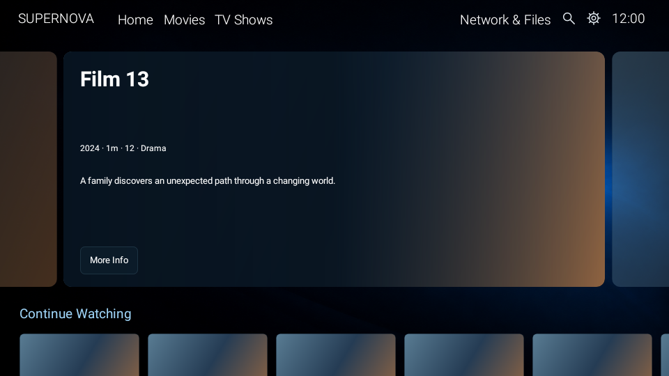
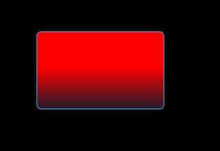

# Foundation Home correction — 0.134 / 134

Current status: all local implementation, regression and optimized unsigned binary checks passed; application source **cf1211ceea12a6e1ae82e10cbfb247d33d4ad01f** is verified and pinned by the following workflow/documentation commit. Corrected signed APK has **not** been produced. The user has authorised corrected delivery using the existing protected workflow. Physical Shield retest remains pending.

## Investigation and bounded correction

[Phase A investigation](FOUNDATION_UI_REGRESSION_INVESTIGATION.md) proves the first signed 0.133 APK used 11766e59, whose Home/card source remained at the earlier 7efb4195 baseline. The later verified corrective lineage was absent. [Other omission register](PREVIEW_OMISSION_REGISTER.json) covers all 36 differing product files; those differences are source evidence, not additional confirmed device failures. Exact installed Legacy APK identity remains unestablished.

- `PreviewFeaturedCard.java` is byte-identical to verified source f97f6294: fixed active/neighbour card composition, rounded local images, official title/logo area, stable metadata/synopsis spacing and one More Info action. Existing artwork request cancellation remains.
- `PreviewPages.java` ports only Home HERO binding, viewport sizing, local Home artwork ownership, transition and rail clearance. Existing candidate selection, library data, discovery, Movies/TV backgrounds, Details callback, remote dispatch and scan semantics are preserved. Left/right changes only the HERO item, retaining row adapter/card identities. No inline Move/Hide, grid-centering or unrelated Settings/Network changes are ported.
- `PreviewCardPresenter.java` ports the accepted rounded child mask and common body/focus scale unit. The image and captions stay inside the same body; the highlight follows that body. Unrelated artwork-retry/backoff changes remain deferred.
- `PreviewDialog.java` adds only the required More Info action-container focus drawable. Other dialog/footer changes remain deferred.
- `FoundationUiPolicy.java` enables the approved UI even when the obsolete stored flag is false; other user choices survive and the policy is idempotent. The disabled preference remains under hidden Legacy; no Try New UI control is exposed.
- The literal release counter advances to **0.134 / 134**. Actual verified signed 0.133 history is added, including the user-reported regressions. All 132 prior historical records are preserved exactly.

## Validation evidence

New regression coverage uses actual production views and Robolectric native graphics, not implementation-text assertions: equal-height neighbours and viewport teaser; wide/tall/compact official-logo fixtures; single More Info action; remote left/right, selected Details callback, retained row/card identities and Down into first row; empty Home and Movies/TV artwork ownership; rounded red-artwork corner pixels and enlarged highlight alignment; first/middle/last row focus and physical viewport edges; restored/fresh UI preferences and hidden obsolete toggle.

[Baseline negative controls](UI_BASELINE_NEGATIVE_CONTROLS.json) restore only the original two implementations in a disposable build. Carousel-presence and rounded-child pixel assertions fail on the original code and pass on the correction. A simple boundary/scale pixel assertion alone also passes the original outer-scale implementation, so acceptance additionally checks the body mask, common-unit structure and row positions. Canonical Foundation work was never reverted.

[Source preservation](UI_SOURCE_COMPARISON.json) records exact reference card bytes and unchanged Foundation identity/manifest/branding/Settings/About/signature-verifier inputs. Native source/configuration and dependencies are unchanged; release conformance checks every resolved runtime artifact, 24 rebuilt FFmpeg libraries, all four ABIs, actual providers, Foundation assets and ten approved branding exports. The protected build repeats native runtime regressions and release checks before accessing the key. The full reviewed unit-count guard now expects 429 and runs for prepare as well as verify; safeguards are strengthened, not bypassed.

[Render hashes](UI_RENDER_EVIDENCE.json) describe synthetic artwork fixtures. These images show real production view rendering and are **not Shield photographs**:

Additional [first](ui-evidence/foundation-home-focus-position-0.png), [middle](ui-evidence/foundation-home-focus-position-5.png), [last](ui-evidence/foundation-home-focus-position-11.png) row focus and [wide](ui-evidence/foundation-home-logo-320.png), [tall](ui-evidence/foundation-home-logo-70.png), [compact](ui-evidence/foundation-home-logo-140.png) logo fixtures are retained.

The complete release command `foundationDependencyInventory testNoamazonReleaseUnitTest lintNoamazonRelease assembleNoamazonRelease -PfoundationVerify -Puniversal --no-daemon --max-workers=4` passed. Final standard assembly was repeated after correcting public historical artifact metadata. [UI_CORRECTED_UNSIGNED_EVIDENCE.json](UI_CORRECTED_UNSIGNED_EVIDENCE.json) records actual unsigned APK SHA-256 **`b3fb6aaed27a9f3b1c5a9f7d546c943c3c877e7810fe75a89f469754ee07696d`**, 429 tests / zero failures, errors or skips; 36 Python guard tests; actionlint PASS; lint zero errors / 1447 warnings. Six additional reference-component warnings are DrawAllocation (2), programmatic ViewConstructor (1), and fixed left/right RtlHardcoded geometry (3); no warning was suppressed. All 1500 canonical product inputs and 110 test sources match the prepared build, with the established provider conversion. The local rehearsal embeds its old disposable checkout SHA/time as informational metadata; the final protected build uses the newly pinned application commit and repeats the complete gates without task exclusions.

## Three review passes

1. **Source selection and targeted scope:** inspected immutable baseline/reference/product differences and first downloaded APK evidence; selected only the two requested corrections and direct dependencies. No fixes-only/main mutation, merge, future features or obsolete toggle.
2. **Functional regression and rendered conformance:** all 429 tests pass without failure/error/skip. Negative controls detect the actual source defects; image inspection confirms bounded active/neighbour cards and highlighted body containment. Exact-return and live metadata/provider behaviour beyond these checks are not claimed fixed.
3. **Foundation preservation and delivery safeguards:** unchanged identity/branding/loading/About/legal/native/signing inputs reviewed; actual optimized binary validation passed (0.134 / 134, 138 runtime artifacts, 88 native libraries, 24 rebuilt FFmpeg libraries, ten visible branding exports, Foundation legal/history bytes and carousel markers). Protected existing certificate remains pinned, no signing material is supplied to this executor, and source must be updated explicitly before a fresh protected build. Compilation alone does not establish restoration.

## Delivery and device limitations

Corrected APK filename will remain `Supernova-Foundation.apk` in the existing verified-APK artifact. Exact source/workflow commit, final signed APK checksum, certificate verification and artifact URL will be recorded after the protected build succeeds. The first APK is independently verified in [FIRST_SIGNED_APK_VERIFICATION.json](FIRST_SIGNED_APK_VERIFICATION.json); its link is not substituted for the corrected delivery.

The earlier first-delivery CLI expiry was rechecked during this continuation: GitHub workflow access now succeeds and fresh dispatch is available. After all checks and commits are concrete, dispatch a new **validate**, then **prepare** run on **codex/foundation-release**. Rerunning an old run would rebuild its old pinned source. No manual dispatch, additional signing key, secret entry or routine authorisation is currently required. Existing protected reviewer prompts, if GitHub presents them, must be satisfied normally.

Physical NVIDIA Shield checks: upgrade 0.133 to 0.134, validate actual Home carousel, first/middle/last artwork zoom containment during scrolling, More Info and Back focus, scan pill and Preparing Playback indicators, About/version/branding, library/network access and playback/resume/audio/subtitles. Real library/provider artwork, Shield GPU/timing and full physical acceptance are pending. Other source omissions remain deferred to the maintenance release.

Verified application/source commit: [cf1211ce](https://github.com/heretoecode/Supernova/commit/cf1211ceea12a6e1ae82e10cbfb247d33d4ad01f). The next workflow-only commit pins this exact source; it does not alter product files. The protected build must emit this source SHA in its public APK evidence.

## Protected execution checkpoint

Workflow pin/documentation commit [4448f67c](https://github.com/heretoecode/Supernova/commit/4448f67c2b7399a36bcee6e8580ace6f2cd91ab1) follows verified application [cf1211ce](https://github.com/heretoecode/Supernova/commit/cf1211ceea12a6e1ae82e10cbfb247d33d4ad01f) without product changes. Fresh [validate 37961683385](https://github.com/heretoecode/Supernova/actions/runs/37961683385) succeeded and independently emitted the unchanged public certificate `79ed34c52c3e359756ade0634d7bbb6f8e94e42a059020c1220bd8c7092a9f5e`; see [UI_SIGNING_VALIDATION.json](UI_SIGNING_VALIDATION.json). User-authorised fresh [prepare 37961864830](https://github.com/heretoecode/Supernova/actions/runs/37961864830) is in progress. Signed correction is not yet claimed; actual published binary will be independently downloaded and verified. Main/fixes-only remote refs remain fca64171 / e24af182.
